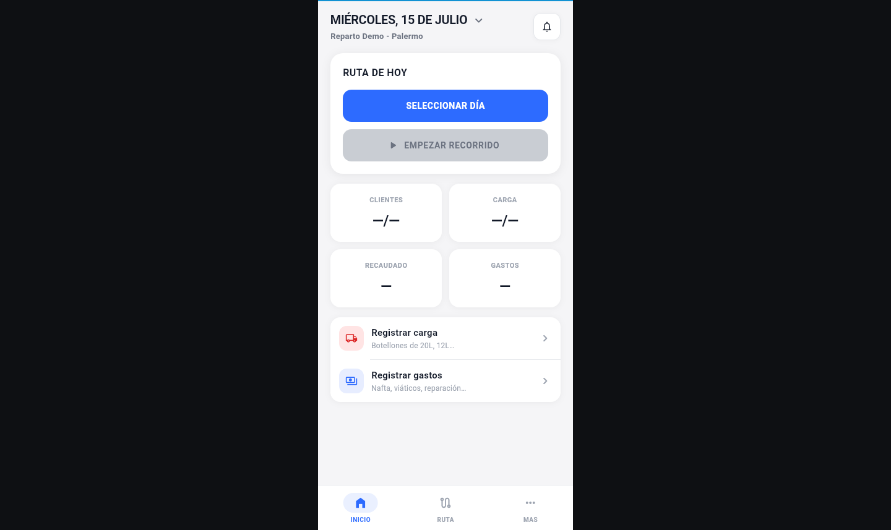
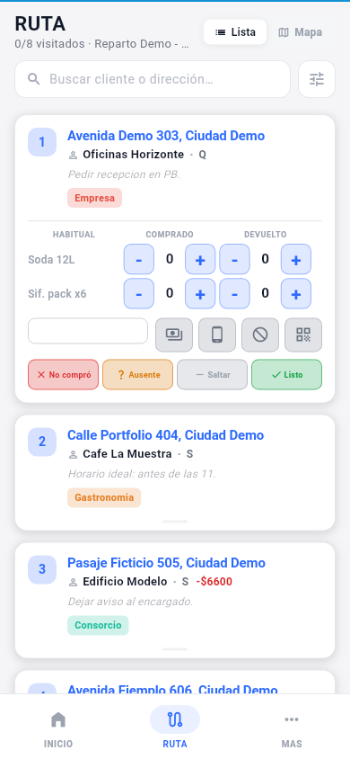

# SODAPP Demo

[Live demo](https://sodapp-demo.pages.dev) · Flutter Web · Offline-first delivery workflow

## English (US)

SODAPP Demo is a safe, static portfolio edition of a production delivery-management application. It presents the Spanish-language mobile workflow used to organize routes, customers, deliveries, payments, daily stock, and summaries.

The demo opens directly into the application with fictional records. All changes stay inside the browser's local Drift database and can be reset by clearing the site's local storage. It does not contain production credentials, customer data, Supabase access, payment integrations, messaging integrations, or native mobile projects.

<p align="center">
  
  
</p>

### Highlights

- Route workflow with customer status, delivery, payment, and account-balance interactions
- Daily stock, expenses, customer management, and operational summaries
- Responsive phone presentation for desktop and mobile browsers
- Browser-local persistence through Drift and SQLite WASM
- Static hosting with a restrictive Content Security Policy
- Automated tests and public-repository safety guards

### Run locally

This repository uses Flutter `3.38.4`.

```bash
flutter pub get
flutter run -d chrome
```

### Verify and build

```bash
flutter analyze --no-fatal-infos --no-fatal-warnings
flutter test
flutter build web --release --no-web-resources-cdn
```

The Cloudflare Pages artifact is generated in `build/web`. No environment variables are required.

## Español (rioplatense)

SODAPP Demo es una edición estática y segura para portfolio de una aplicación productiva de gestión de repartos. La interfaz se mantiene en español y permite recorrer el flujo móvil para organizar rutas, clientes, entregas, pagos, carga diaria y resúmenes.

La demo entra directamente a la aplicación con datos ficticios. Todos los cambios quedan solamente en la base local de Drift del navegador y se pueden reiniciar borrando los datos locales del sitio. El repositorio no incluye credenciales productivas, datos reales de clientes, acceso a Supabase, integraciones de pago, mensajería ni proyectos móviles nativos.

### Funcionalidades destacadas

- Recorrido diario con estados de clientes, entregas, pagos y cuenta corriente
- Carga, gastos, gestión de clientes y resúmenes operativos
- Presentación adaptable tipo teléfono para navegadores de escritorio y celulares
- Persistencia local con Drift y SQLite WASM
- Hosting estático con una política de seguridad restrictiva
- Tests automatizados y controles para mantener público el repositorio

### Ejecutar localmente

```bash
flutter pub get
flutter run -d chrome
```

### Verificar y compilar

```bash
flutter analyze --no-fatal-infos --no-fatal-warnings
flutter test
flutter build web --release --no-web-resources-cdn
```

El resultado para Cloudflare Pages se genera en `build/web` y no necesita variables de entorno.

## Public Demo Boundary

This repository is an independent, history-free demo. It is not the production SODAPP repository and does not share its backend, deployment configuration, Git history, or secrets.

Copyright © 2026 Teodor Topan. All rights reserved.
