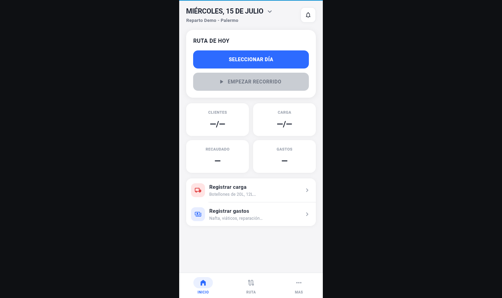
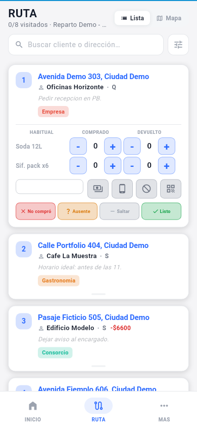
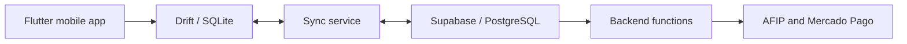

# SODAPP Demo

**Live demo:** [sodapp-demo.pages.dev](https://sodapp-demo.pages.dev/)

## English (US)

This repository is a browser-only demo of SODAPP, a delivery app I built for small distributors in Argentina. The interface is in Spanish because that is how the product is used. It covers the daily route, customer accounts, deliveries, payments, stock, expenses, and end-of-day summaries.

The demo opens with fictional records and saves changes in a local Drift database inside the browser. It does not connect to the production backend or contain customer data, credentials, payment integrations, messaging integrations, or the native mobile projects.

> Every customer, address, phone number, delivery, payment, and balance shown here is fictional demo data.

<p align="center">
  
  
</p>

### How the production app works

Drivers can spend hours without a reliable connection, so the mobile app reads and writes to Drift and SQLite first. Changes are queued on the device and synchronized with Supabase when a connection is available. Deleted records are kept as tombstones during synchronization so an older device cannot accidentally bring them back.

The production app also connects to Mercado Pago and Argentina's AFIP electronic-invoicing system. Those requests go through authenticated backend functions; service credentials are never stored in the mobile client. The public demo keeps the user interface, local database, and selected business rules, but replaces the backend with fictional browser data.


```mermaid
flowchart LR
    A[Flutter mobile app] --> B[Drift / SQLite]
    B <--> C[Sync service]
    C <--> D[Supabase / PostgreSQL]
    D --> E[Backend functions]
    E --> F[AFIP and Mercado Pago]
```

### Highlights

- Route workflow with customer status, delivery, payment, and account-balance interactions
- Daily stock, expenses, customer management, and operational summaries
- Responsive phone presentation for desktop and mobile browsers
- Browser-local persistence through Drift and SQLite WASM
- Static hosting with a restrictive Content Security Policy
- Automated tests and public-repository safety guards

### Run locally

This repository uses Flutter `3.44.0`.

```bash
flutter pub get
flutter run -d chrome
```

### Verify and build

```bash
flutter analyze --no-fatal-infos --no-fatal-warnings
flutter test
flutter build web --release --no-web-resources-cdn
```

The Cloudflare Pages artifact is generated in `build/web`. No environment variables are required.

### Technology

Flutter Web, Dart, Drift, SQLite WASM, Material Design, and Cloudflare Pages.

### What is left out

This is an independent, history-free demo. The production backend, deployment configuration, Git history, customer data, and secrets are not included.

### License

No license is provided for this repository. Copyright © 2026 Teodor Topan. All rights reserved.

---

# SODAPP Demo - Español

**Demo online:** [sodapp-demo.pages.dev](https://sodapp-demo.pages.dev/)

Este repositorio es una demo para navegador de SODAPP, una aplicación de reparto que desarrollé para pequeños distribuidores de Argentina. La interfaz está en español porque así se usa el producto. Incluye el recorrido diario, las cuentas de los clientes, entregas, pagos, carga, gastos y resúmenes de cierre.

La demo abre con datos ficticios y guarda los cambios en una base local de Drift dentro del navegador. No se conecta al backend productivo ni contiene datos de clientes, credenciales, integraciones de pago, mensajería o los proyectos móviles nativos.

> Todos los clientes, domicilios, teléfonos, repartos, pagos y saldos que aparecen acá son datos ficticios de demostración.

### Cómo funciona la aplicación productiva

Los repartidores pueden pasar varias horas sin una conexión confiable, por eso la aplicación móvil primero lee y escribe en Drift y SQLite. Los cambios quedan en cola en el dispositivo y se sincronizan con Supabase cuando vuelve la conexión. Los registros eliminados se conservan como tombstones durante la sincronización para evitar que un dispositivo desactualizado los vuelva a crear por error.

La versión productiva también se integra con Mercado Pago y el sistema de facturación electrónica de AFIP. Esas solicitudes pasan por funciones autenticadas del backend; las credenciales de los servicios nunca se guardan en el cliente móvil. La demo pública conserva la interfaz, la base local y algunas reglas del negocio, pero reemplaza el backend por datos ficticios en el navegador.

### Funcionalidades destacadas

- Recorrido diario con estados de clientes, entregas, pagos y cuenta corriente
- Carga, gastos, gestión de clientes y resúmenes operativos
- Presentación adaptable tipo teléfono para navegadores de escritorio y celulares
- Persistencia local con Drift y SQLite WASM
- Hosting estático con una política de seguridad restrictiva
- Tests automatizados y controles para mantener público el repositorio

### Ejecutar localmente

```bash
flutter pub get
flutter run -d chrome
```

### Verificar y compilar

```bash
flutter analyze --no-fatal-infos --no-fatal-warnings
flutter test
flutter build web --release --no-web-resources-cdn
```

El resultado para Cloudflare Pages se genera en `build/web` y no necesita variables de entorno.

### Tecnologías

Flutter Web, Dart, Drift, SQLite WASM, Material Design y Cloudflare Pages.

### Qué no está incluido

Esta es una demo independiente y sin el historial de Git del producto. El backend productivo, la configuración de despliegue, el historial, los datos de clientes y los secretos no están incluidos.

### Licencia

Este repositorio no incluye una licencia. Copyright © 2026 Teodor Topan. Todos los derechos reservados.
